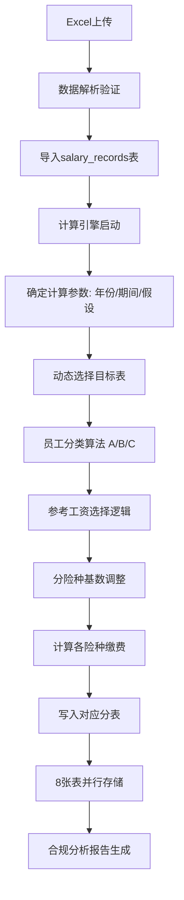
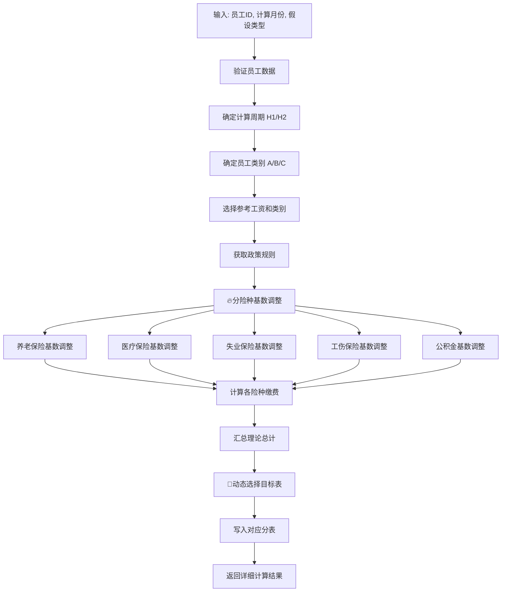

# CLAUDE.md

本文件为 Claude Code (claude.ai/code) 提供在此代码仓库中工作的指引。

## 🛡️ 信任工具白名单

根据操作风险级别，建立以下工具使用策略：

### 🟢 绿灯区 - 自动执行（无需确认）

**Git操作类**：
- `git status` - 查看仓库状态
- `git add` - 添加文件到暂存区
- `git commit` - 创建提交
- `git diff` - 查看差异
- `git log` - 查看提交历史
- `git branch` - 分支操作
- `git checkout` - 切换分支/文件
- `git pull` - 拉取更新
- `git push` - 推送代码

**文件操作类**：
- `Read` - 读取文件内容
- `Write` - 写入文件
- `Edit` - 编辑文件
- `MultiEdit` - 批量编辑
- `Glob` - 文件模式匹配
- `LS` - 列出目录内容
- `Grep` - 文本搜索

**开发工具类**：
- `npm install` - 安装依赖包
- `npm run dev` - 启动开发服务器
- `npm run build` - 构建项目
- `npm run lint` - 代码检查
- `npm run format` - 代码格式化
- `npm test` - 运行测试
- `pytest` - Python测试
- `node` - 执行Node.js脚本

**数据库操作类**：
- Supabase数据查询和插入操作
- 数据库表创建和修改（开发环境）

### 🟡 黄灯区 - 需要确认

**系统命令类**：
- `curl` - 网络请求（除预定义的API）
- `wget` - 文件下载
- `mkdir` - 创建目录
- `cp` - 复制文件
- `mv` - 移动文件
- 环境变量设置
- 端口占用检查

**网络操作类**：
- `WebFetch` - 获取网页内容
- `WebSearch` - 网络搜索
- API调用（非预定义白名单）

**包管理类**：
- `pip install` - Python包安装
- `npm uninstall` - 卸载包
- 全局包安装

### 🔴 红灯区 - 永远手动确认

**危险删除类**：
- `rm` - 删除文件
- `rmdir` - 删除目录
- `git reset --hard` - 硬重置
- `npm run clean` - 清理操作
- 数据库DROP操作

**系统配置类**：
- 修改系统配置文件
- 权限修改操作
- 服务启停操作
- 防火墙配置

**生产环境类**：
- 生产数据库操作
- 生产服务器部署
- 域名DNS配置
- SSL证书操作

### 📋 白名单使用说明

1. **绿灯区操作**：Claude可以直接执行，无需用户确认
2. **黄灯区操作**：Claude会描述操作内容，等待用户确认后执行
3. **红灯区操作**：Claude必须详细说明风险，获得明确授权后才能执行
4. **特殊情况**：涉及敏感数据或不确定风险的操作，统一归入红灯区

### 🔧 预定义安全命令

以下命令已预定义为安全命令，可直接执行：
```bash
# 开发服务器
npm run dev
npm start
bun dev

# 构建和测试
npm run build
npm run test
npm run lint
npm run format

# Git基础操作
git status
git add .
git commit -m "message"
git diff
git log --oneline

# Supabase操作
export SUPABASE_URL="https://your-project-id.supabase.co"
export SUPABASE_SERVICE_ROLE_KEY="your-service-role-key"

# Node.js脚本执行
node scripts/[script-name].js
```

## 🎯 项目概述

**五险一金尽职调查网站** - 专业的Web应用程序，用于企业五险一金合规性分析和尽职调查。

### 核心目标

通过自动化批量测算，精准对比企业理论应缴额与实际缴纳额，识别潜在的合规风险（如少缴、漏缴）。

### 项目特点

- **分析周期**: 2023年1月1日-2024年9月30日
- **调基规则**: 每年7月1日调基，上下半年适用不同标准
- **计算假设**: 支持双重假设（宽口径/窄口径）独立测算
- **目标用户**: 企业HR部门、尽职调查机构、合规审计团队
- **地区定位**: 以佛山地区为例，可扩展至其他城市

### 业务价值

- **风险识别**: 自动发现五险一金缴费不合规情况
- **成本分析**: 量化合规缺口的财务影响
- **决策支持**: 为企业合规整改提供数据依据

## 🏗️ 技术架构

### 技术栈选择

- **前端框架**: Next.js 15 (App Router) + TypeScript
- **样式系统**: Tailwind CSS + shadcn/ui组件库
- **数据库**: Supabase (PostgreSQL) + 实时订阅
- **文件处理**: xlsx库处理Excel解析
- **状态管理**: React hooks + Zustand (可选)
- **包管理器**: npm (推荐) 或 Bun

### 项目结构 (新项目)

```
foshan/                       # 项目根目录
├── src/
│   ├── app/                  # Next.js App Router
│   │   ├── page.tsx          # 主页面
│   │   ├── layout.tsx        # 根布局
│   │   ├── globals.css       # 全局样式
│   │   └── api/              # API路由 (可选)
│   ├── components/
│   │   ├── DataUpload.tsx    # Excel文件上传组件
│   │   ├── Calculator.tsx    # 五险一金计算引擎
│   │   ├── ResultsTable.tsx  # 结果展示表格
│   │   ├── ComplianceAnalysis.tsx # 合规分析组件
│   │   └── ui/               # shadcn/ui组件库
│   ├── lib/
│   │   ├── supabase.ts       # Supabase客户端
│   │   ├── calculator.ts     # 计算逻辑核心
│   │   ├── utils.ts          # 工具函数
│   │   └── types.ts          # TypeScript类型定义
│   └── hooks/                # 自定义React hooks
├── public/                   # 静态文件
├── docs/                     # 项目文档
└── 存档/                     # 历史项目参考 (开发完成后删除)
```

### 架构设计原则

- **模块化**: 业务逻辑与UI分离
- **类型安全**: 全面TypeScript类型覆盖
- **性能优先**: 批量处理大量数据
- **用户体验**: 实时进度反馈和错误处理

## 🚀 快速开始

### 1. 环境设置

```bash
# 克隆并进入项目目录
cd foshan

# 安装依赖 (推荐使用npm)
npm install
# 或使用Bun: bun install

# 复制环境变量模板
cp .env.example .env.local
# 编辑 .env.local，填入Supabase项目凭据
```

### 2. 开发命令

```bash
# 启动开发服务器
npm run dev
# 或: bun dev

# 构建生产版本
npm run build

# 启动生产服务器
npm start

# 代码检查和格式化
npm run lint
npm run format
```

### 3. 数据库配置

```bash
# 初始化Supabase数据库结构
# (执行 docs/database_schema.sql)
supabase db reset

# 生成TypeScript数据库类型
supabase gen types typescript --project-id your-project-id > src/lib/database.types.ts

# 插入测试数据 (可选)
# 使用 数据/ 目录下的脱敏数据进行测试
```

## 📊 数据架构与业务模型

### 核心数据表设计

#### 1. 员工数据架构说明

**当前实现**: 无独立employees表，员工信息存储在salary_records表中
- **员工工号**: salary_records.employee_id
- **入职日期**: salary_records.hire_date (每条记录保持一致)
- **员工姓名**: 当前未存储 (脱敏处理)

```sql
-- 员工信息通过salary_records表的聚合查询获取
SELECT DISTINCT employee_id, hire_date 
FROM salary_records 
GROUP BY employee_id, hire_date
```

#### 2. salary_records (工资记录表)

```sql
- id (UUID, 主键)
- employee_id (TEXT, 外键)
- salary_month (TEXT)                    -- 工资月份 (中文格式: "2023年1月")
- gross_salary (DECIMAL)                 -- 应发工资合计
- basic_salary (DECIMAL)                 -- 正常工作时间工资
- actual_ss_payment (DECIMAL, 可选)      -- 实际社保缴纳额
- actual_hf_payment (DECIMAL, 可选)      -- 实际公积金缴纳额
- created_at (TIMESTAMPTZ)
- UNIQUE(employee_id, salary_month)
```

#### 3. policy_rules (政策规则表)

```sql
CREATE TABLE policy_rules (
  id UUID PRIMARY KEY DEFAULT gen_random_uuid(),
  city TEXT NOT NULL DEFAULT '佛山',
  year INTEGER NOT NULL,               -- 年份 (2023, 2024)
  period TEXT NOT NULL,                -- 期间 ('H1', 'H2')
  effective_start DATE NOT NULL,       -- 生效开始日期
  effective_end DATE NOT NULL,         -- 生效结束日期

  -- 各险种基数上下限 (分险种独立设置)
  pension_base_floor DECIMAL(10,2) NOT NULL,      -- 养老保险基数下限
  pension_base_cap DECIMAL(10,2) NOT NULL,        -- 养老保险基数上限
  medical_base_floor DECIMAL(10,2) NOT NULL,       -- 医疗保险基数下限
  medical_base_cap DECIMAL(10,2) NOT NULL,         -- 医疗保险基数上限
  unemployment_base_floor DECIMAL(10,2) NOT NULL,  -- 失业保险基数下限
  unemployment_base_cap DECIMAL(10,2) NOT NULL,    -- 失业保险基数上限
  injury_base_floor DECIMAL(10,2) NOT NULL,        -- 工伤保险基数下限
  injury_base_cap DECIMAL(10,2) NOT NULL,          -- 工伤保险基数上限

  -- 公积金基数上下限
  hf_base_floor DECIMAL(10,2) NOT NULL,    -- 公积金基数下限
  hf_base_cap DECIMAL(10,2) NOT NULL,      -- 公积金基数上限

  -- 企业缴费比例 (小数形式存储)
  pension_rate_enterprise DECIMAL(6,4) NOT NULL,     -- 养老保险企业比例
  medical_rate_enterprise DECIMAL(6,4) NOT NULL,     -- 医疗保险企业比例
  unemployment_rate_enterprise DECIMAL(6,4) NOT NULL, -- 失业保险企业比例
  injury_rate_enterprise DECIMAL(6,4) NOT NULL,      -- 工伤保险企业比例
  maternity_rate_enterprise DECIMAL(6,4) NOT NULL,   -- 生育保险企业比例
  hf_rate_enterprise DECIMAL(6,4) NOT NULL,          -- 住房公积金企业比例

  -- 员工缴费比例 (用于完整性)
  pension_rate_employee DECIMAL(6,4) DEFAULT 0.08,
  medical_rate_employee DECIMAL(6,4) DEFAULT 0.02,
  unemployment_rate_employee DECIMAL(6,4) DEFAULT 0,
  hf_rate_employee DECIMAL(6,4) DEFAULT 0.05,

  -- 备注信息
  medical_note TEXT,                   -- 医疗保险备注 (如"给缴结合：2%")
  hf_note TEXT,                       -- 公积金备注 (如"单建统筹：4%")

  created_at TIMESTAMPTZ DEFAULT NOW(),
  updated_at TIMESTAMPTZ DEFAULT NOW(),

  UNIQUE(city, year, period)
);

-- 索引优化
CREATE INDEX idx_policy_rules_year_period ON policy_rules(year, period);
CREATE INDEX idx_policy_rules_effective_dates ON policy_rules(effective_start, effective_end);
```

#### 4. 8张分表计算结果表架构

**⚠️ 重要变更：已从单一calculation_results表升级为8张分表架构**

##### 8张分表设计原理

为了支持更精细的分险种基数调整和提升查询性能，将计算结果按以下维度分为8张独立表：

**分表维度组合：**
- **年份维度**: 2023年、2024年 (2个年份)
- **期间维度**: H1上半年、H2下半年 (2个期间) 
- **假设维度**: 宽口径(wide)、窄口径(narrow) (2种假设)
- **总计**: 2 × 2 × 2 = 8张表

**8张表清单：**
1. `calculate_result_2023_H1_wide` - 2023年上半年宽口径
2. `calculate_result_2023_H1_narrow` - 2023年上半年窄口径
3. `calculate_result_2023_H2_wide` - 2023年下半年宽口径
4. `calculate_result_2023_H2_narrow` - 2023年下半年窄口径
5. `calculate_result_2024_H1_wide` - 2024年上半年宽口径
6. `calculate_result_2024_H1_narrow` - 2024年上半年窄口径
7. `calculate_result_2024_H2_wide` - 2024年下半年宽口径 (仅7-9月)
8. `calculate_result_2024_H2_narrow` - 2024年下半年窄口径 (仅7-9月)

##### 统一表结构设计 (共25个核心字段)

```sql
CREATE TABLE calculate_result_YYYY_HX_TYPE (
  id UUID PRIMARY KEY DEFAULT gen_random_uuid(),
  employee_id TEXT NOT NULL,                    -- 员工工号
  calculation_month DATE NOT NULL,              -- 计算月份
  employee_category TEXT NOT NULL,              -- 员工类别 (A/B/C)
  
  -- 参考工资基础信息 (2个字段)
  reference_wage_base DECIMAL(10,2) NOT NULL,       -- 参考工资基数(调整前)
  reference_wage_category TEXT NOT NULL,            -- 参考工资类别("2022年平均工资"等)
  
  -- 养老保险调整过程 (3个字段)
  pension_base_floor DECIMAL(10,2) NOT NULL,        -- 养老保险基数下限
  pension_base_cap DECIMAL(10,2) NOT NULL,          -- 养老保险基数上限  
  pension_adjusted_base DECIMAL(10,2) NOT NULL,     -- 养老保险调整后基数
  
  -- 医疗保险调整过程 (3个字段)
  medical_base_floor DECIMAL(10,2) NOT NULL,        -- 医疗保险基数下限
  medical_base_cap DECIMAL(10,2) NOT NULL,          -- 医疗保险基数上限
  medical_adjusted_base DECIMAL(10,2) NOT NULL,     -- 医疗保险调整后基数
  
  -- 失业保险调整过程 (3个字段)
  unemployment_base_floor DECIMAL(10,2) NOT NULL,   -- 失业保险基数下限
  unemployment_base_cap DECIMAL(10,2) NOT NULL,     -- 失业保险基数上限
  unemployment_adjusted_base DECIMAL(10,2) NOT NULL, -- 失业保险调整后基数
  
  -- 工伤保险调整过程 (3个字段)
  injury_base_floor DECIMAL(10,2) NOT NULL,         -- 工伤保险基数下限
  injury_base_cap DECIMAL(10,2) NOT NULL,           -- 工伤保险基数上限
  injury_adjusted_base DECIMAL(10,2) NOT NULL,      -- 工伤保险调整后基数
  
  -- 住房公积金调整过程 (3个字段)
  hf_base_floor DECIMAL(10,2) NOT NULL,             -- 公积金基数下限
  hf_base_cap DECIMAL(10,2) NOT NULL,               -- 公积金基数上限
  hf_adjusted_base DECIMAL(10,2) NOT NULL,          -- 公积金调整后基数
  
  -- 各险种缴费金额 (6个字段)
  pension_payment DECIMAL(10,2) NOT NULL,           -- 养老保险应缴
  medical_payment DECIMAL(10,2) NOT NULL,           -- 医疗保险应缴
  unemployment_payment DECIMAL(10,2) NOT NULL,      -- 失业保险应缴
  injury_payment DECIMAL(10,2) NOT NULL,            -- 工伤保险应缴
  hf_payment DECIMAL(10,2) NOT NULL,                -- 住房公积金应缴
  theoretical_total DECIMAL(10,2) NOT NULL,         -- 理论总计 (5项之和)
  
  created_at TIMESTAMPTZ DEFAULT NOW(),
  UNIQUE(employee_id, calculation_month)             -- 员工+月份唯一约束
);
```

##### 分险种基数调整核心逻辑

**关键业务变更：每个险种独立进行基数调整**

```typescript

// 新逻辑：分险种独立基数调整
const pensionAdjusted = Math.min(Math.max(referenceWage, rules.pension_base_floor), rules.pension_base_cap)
const medicalAdjusted = Math.min(Math.max(referenceWage, rules.medical_base_floor), rules.medical_base_cap)
const unemploymentAdjusted = Math.min(Math.max(referenceWage, rules.unemployment_base_floor), rules.unemployment_base_cap)
const injuryAdjusted = Math.min(Math.max(referenceWage, rules.injury_base_floor), rules.injury_base_cap) // 工伤保险按独立上下限调整
const hfAdjusted = Math.min(Math.max(referenceWage, rules.hf_base_floor), rules.hf_base_cap)
```

**5个险种的差异化处理：**

1. **养老保险**: 按独立基数上下限调整 (`pension_base_floor`, `pension_base_cap`)
2. **医疗保险**: 按独立基数上下限调整 (`medical_base_floor`, `medical_base_cap`)
3. **失业保险**: 按独立基数上下限调整 (`unemployment_base_floor`, `unemployment_base_cap`)
4. **工伤保险**: 按独立基数上下限调整 (`injury_base_floor`, `injury_base_cap`)
5. **住房公积金**: 按独立基数上下限调整 (`hf_base_floor`, `hf_base_cap`)

##### 表名动态选择逻辑

```typescript
// 根据计算参数确定目标表名
export function getCalculationTableName(
  year: number,                    // 2023 | 2024
  period: 'H1' | 'H2',            // 上半年 | 下半年
  assumption: 'wide' | 'narrow'   // 宽口径 | 窄口径
): CalculationTable {
  return `calculate_result_${year}_${period}_${assumption}` as CalculationTable
}

// 使用示例
const tableName = getCalculationTableName(2023, 'H1', 'wide')
// 返回: "calculate_result_2023_H1_wide"
```

##### 数据分布策略

**时间维度分布：**
- **2023_H1**: 2023年1月-6月 (6个月)
- **2023_H2**: 2023年7月-12月 (6个月)  
- **2024_H1**: 2024年1月-6月 (6个月)
- **2024_H2**: 2024年7月-9月 (仅3个月，当前数据截止到9月)

**假设维度分布：**
- **wide口径**: 基于`gross_salary`(应发工资合计)计算的最大风险评估
- **narrow口径**: 基于`basic_salary`(正常工作时间工资)计算的保守评估

##### 分表架构优势

1. **性能优化**: 数据按时间维度分片，查询效率显著提升
2. **存储隔离**: 不同假设结果独立存储，避免数据混淆
3. **并行计算**: 8张表可并行写入，提升批量计算性能
4. **政策适配**: 每个半年期间对应不同政策规则，表结构天然匹配
5. **维护便利**: 独立表结构便于单独优化和维护
6. **扩展性强**: 未来新增年份或期间只需新建对应表

##### TypeScript类型支持

```typescript
// 8张表的类型联合
export type CalculationTable = 
  | 'calculate_result_2023_H1_wide'
  | 'calculate_result_2023_H1_narrow'
  | 'calculate_result_2023_H2_wide' 
  | 'calculate_result_2023_H2_narrow'
  | 'calculate_result_2024_H1_wide'
  | 'calculate_result_2024_H1_narrow'
  | 'calculate_result_2024_H2_wide'
  | 'calculate_result_2024_H2_narrow'

// 新的详细计算结果接口
export interface CalculationResultNew {
  id: string
  employee_id: string
  calculation_month: Date
  employee_category: 'A' | 'B' | 'C'
  
  // 25个核心业务字段 (如上表结构所示)
  reference_wage_base: number
  reference_wage_category: ReferenceWageCategory
  
  pension_base_floor: number
  pension_base_cap: number  
  pension_adjusted_base: number
  // ... 其他险种字段
  
  theoretical_total: number
  created_at: Date
}
```

### 8张分表计算流程



## 🚨 数据库操作重要约束

**⚠️ 重要提醒：在我确认之前不要改动Supabase里表的数据，必须提前征得我的同意。**

所有涉及数据库表结构修改、数据删除、数据更新的操作，都必须：
1. 先提出计划和SQL语句
2. 等待用户确认
3. 获得明确同意后才能执行

这包括但不限于：
- ALTER TABLE 操作
- DROP COLUMN 操作  
- DELETE/UPDATE 数据操作
- INSERT 政策规则数据
- 任何可能影响现有数据的操作

## 🔍 核心业务逻辑

### 五险一金计算框架

基于Supabase中实际的policy_rules表结构，确定最终计算逻辑：

#### 需要计算的项目（5项）：
1. **养老保险** - 需要基数调整（有上下限）
2. **失业保险** - 需要基数调整（有上下限）
3. **医疗保险** - 需要基数调整（有上下限）
4. **工伤保险** - 不需要基数调整（直接用工资基数）
5. **住房公积金** - 需要基数调整（有上下限）

#### 不再计算的项目：
- **生育保险** - 已从业务需求中移除

#### 基数调整逻辑：
```typescript
// 需要基数调整的险种
function calculateAdjustedBase(referenceWage: number, baseFloor: number, baseCap: number): number {
  return Math.min(Math.max(referenceWage, baseFloor), baseCap)
}

// 5个险种都需要基数调整：
// 养老保险基数 = min(max(参考工资, pension_base_floor), pension_base_cap)
// 医疗保险基数 = min(max(参考工资, medical_base_floor), medical_base_cap)
// 失业保险基数 = min(max(参考工资, unemployment_base_floor), unemployment_base_cap)  
// 工伤保险基数 = min(max(参考工资, injury_base_floor), injury_base_cap)
// 住房公积金基数 = min(max(参考工资, hf_base_floor), hf_base_cap)
```

### 参考工资基数选择算法 (基于社保年度)

#### 核心概念：社保年度制
- **社保年度周期**: 每年7月1日到次年6月30日
- **选择判断时机**: 基于要计算的月份确定所属社保年度，再判断参考工资类型
- **政策滞后性**: 新政策数据需要时间积累，存在数据替代机制

#### 简化选择算法:

```typescript
function selectReferenceWageAndCategory(
  employeeId: string,
  hireDate: Date,
  calculationMonth: Date,
  assumption: 'wide' | 'narrow'
): Promise<{ wage: number; category: ReferenceWageCategory }> {
  const hireYear = hireDate.getFullYear()
  const calculationMonthNum = calculationMonth.getMonth() + 1
  const calculationYear = calculationMonth.getFullYear()
  
  // 确定计算月份所属的社保年度
  let socialSecurityYear: number
  if (calculationMonthNum >= 7) {
    // 7-12月属于当年社保年度
    socialSecurityYear = calculationYear
  } else {
    // 1-6月属于上一年社保年度  
    socialSecurityYear = calculationYear - 1
  }
  
  // 基于入职年份与社保年度关系选择参考工资
  if (hireYear < socialSecurityYear) {
    // 社保年度开始前入职：使用上一年月平均工资
    const targetYear = socialSecurityYear - 1
    return {
      wage: await getEmployeeAverageSalary(employeeId, targetYear, assumption),
      category: `${targetYear}年平均工资`
    }
  } else {
    // 社保年度内或之后入职：使用入职首月工资
    return {
      wage: await getEmployeeFirstMonthSalary(employeeId, assumption),
      category: '入职首月工资'
    }
  }
}
```

### 社保年度映射表

#### 4个计算期间的社保年度对应关系:

| 计算期间 | 社保年度 | 生效时间 |
|----------|----------|----------|
| 2023年1-6月 (H1) | 2022社保年度 | 2022年7月-2023年6月 |
| 2023年7-12月 (H2) | 2023社保年度 | 2023年7月-2024年6月 |
| 2024年1-6月 (H1) | 2023社保年度 | 2023年7月-2024年6月 |
| 2024年7-9月 (H2) | 2024社保年度 | 2024年7月-2025年6月 |

#### 4个计算期间参考工资选择详表 (基于jishu.md):

**2023H1（2023-01~06，社保年度=2022）**
- 2021-11 入职: 用 2022年均 (特殊替代：原本应用2021年均，但用2022年替代)
- 2022-01 入职: 用 首月工资
- 2022-07 入职: 用 首月工资
- 2023-01 入职: 用 首月工资
- 2023-07 入职: 本期不存在
- 2024-01 入职: 本期不存在
- 2024-07 入职: 本期不存在

**2023H2（2023-07~09，社保年度=2023）**
- 2021-11 入职: 用 2022年均
- 2022-01 入职: 用 2022年均
- 2022-07 入职: 用 2022年均
- 2023-01 入职: 用 首月工资
- 2023-07 入职: 用 首月工资
- 2024-01 入职: 本期不存在
- 2024-07 入职: 本期不存在

**2024H1（2024-01~06，社保年度=2023）**
- 2021-11 入职: 用 2022年均
- 2022-01 入职: 用 2022年均
- 2022-07 入职: 用 2022年均
- 2023-01 入职: 用 首月工资
- 2023-07 入职: 用 首月工资
- 2024-01 入职: 用 首月工资
- 2024-07 入职: 本期不存在

**2024H2（2024-07~09，社保年度=2024）**
- 2021-11 入职: 用 2023年均
- 2022-01 入职: 用 2023年均
- 2022-07 入职: 用 2023年均
- 2023-01 入职: 用 2023年均
- 2023-07 入职: 用 2023年均
- 2024-01 入职: 用 首月工资
- 2024-07 入职: 用 首月工资

#### 关键业务逻辑总结:

1. **社保年度是唯一判断基准**: 入职年份与社保年度的关系决定参考工资类型
2. **二元选择规则**: 入职年份 < 社保年度 → 使用前一年均工资；入职年份 >= 社保年度 → 使用首月工资
3. **参考年份动态变化**: 2024H2期间切换到使用2023年均工资
4. **简化分类逻辑**: 不再使用ABC分类，直接基于入职时间与社保年度关系判断
5. **2023年H1特殊处理**: 由于缺乏2021年数据，用2022年平均工资替代原本需要的2021年平均工资

### 双重计算假设机制

#### 假设一 (宽口径)

- **基数来源**: 应发工资合计 (`gross_salary`)
- **适用场景**: 最大合规风险评估
- **计算公式**: `缴费基数 = min(max(应发工资合计, 基数下限), 基数上限)`

#### 假设二 (窄口径)

- **基数来源**: 正常工作时间工资 (`basic_salary`)
- **适用场景**: 保守合规评估
- **计算公式**: `缴费基数 = min(max(正常工作时间工资, 基数下限), 基数上限)`

### 调基时间点规则

- **调基日期**: 每年7月1日
- **H1周期**: 1月-6月 (使用上一年度标准)
- **H2周期**: 7月-12月 (使用当年度更新标准)

## 📥 数据初始化模块

### 工资数据结构说明

#### Excel文件组织结构

```
工资数据/
├── 2022年工资表.xlsx          # 12个Sheet (2022年1月 - 2022年12月)
├── 2023年工资表.xlsx          # 12个Sheet (2023年1月 - 2023年12月)
└── 2024年工资表.xlsx          # 9个Sheet (2024年1月 - 2024年9月)
```

#### Sheet标准格式

- **命名规则**: "2024年1月", "2024年2月", ... "2024年9月"
- **数据列**: 工号 | 入厂时间 | 正常工作时间工资 | 应发工资合计
- **数据特点**: 在职员工当月出现，离职员工不出现

### 数据导入策略

#### 1. Excel解析逻辑

```typescript
interface ExcelParseResult {
  fileName: string // "2024年工资表.xlsx"
  year: number // 2024
  sheets: SheetData[] // 每个sheet的解析结果
}

interface SheetData {
  sheetName: string // "2024年9月"
  salaryMonth: Date // 2024-09-01 (从sheet名推导)
  records: SalaryRecord[] // 该月所有员工记录
}

interface SalaryRecord {
  employeeId: string // 工号 (如: DF-2127)
  hireDate: Date // 入厂时间
  basicSalary: number // 正常工作时间工资 (窄口径基数)
  grossSalary: number // 应发工资合计 (宽口径基数)
}
```

#### 2. Supabase数据表结构

```sql
-- 工资记录表 (单一表存储所有年份月份数据)
CREATE TABLE salary_records (
  id UUID PRIMARY KEY DEFAULT gen_random_uuid(),
  employee_id TEXT NOT NULL,            -- 工号
  hire_date DATE NOT NULL,              -- 入厂时间
  salary_month TEXT NOT NULL,           -- 工资月份 (中文格式: "2023年1月")
  basic_salary DECIMAL(10,2) NOT NULL,  -- 正常工作时间工资
  gross_salary DECIMAL(10,2) NOT NULL,  -- 应发工资合计
  created_at TIMESTAMPTZ DEFAULT NOW(),
  updated_at TIMESTAMPTZ DEFAULT NOW(),

  UNIQUE(employee_id, salary_month)     -- 员工+月份唯一约束
);

-- 创建索引提升查询性能
CREATE INDEX idx_salary_records_employee_id ON salary_records(employee_id);
CREATE INDEX idx_salary_records_salary_month ON salary_records(salary_month);
CREATE INDEX idx_salary_records_hire_date ON salary_records(hire_date);
```

#### 3. 批量导入流程


### 增量导入机制

#### 数据覆盖策略

```typescript
// UPSERT操作: 存在则更新，不存在则插入
async function upsertSalaryRecords(records: SalaryRecord[]) {
  return await supabase.from('salary_records').upsert(records, {
    onConflict: 'employee_id,salary_month',
    ignoreDuplicates: false, // 允许更新已存在记录
  })
}
```

#### 导入状态跟踪

```sql
-- 导入日志表
CREATE TABLE import_logs (
  id UUID PRIMARY KEY DEFAULT gen_random_uuid(),
  file_name TEXT NOT NULL,              -- Excel文件名
  import_type TEXT NOT NULL,            -- 'salary_data' | 'policy_rules'
  records_imported INTEGER NOT NULL,    -- 导入记录数
  records_updated INTEGER NOT NULL,     -- 更新记录数
  records_failed INTEGER NOT NULL,      -- 失败记录数
  error_details JSONB,                  -- 错误详情
  import_duration_ms INTEGER,           -- 导入耗时
  created_at TIMESTAMPTZ DEFAULT NOW()
);
```

### 入离职状态推导

#### 员工状态判断逻辑

```typescript
// 根据工资记录推导员工入离职状态
async function deriveEmployeeStatus() {
  // 1. 入职时间: hire_date字段
  // 2. 离职时间: 最后一次出现在工资表的月份

  const employeeStatus = await supabase.rpc('calculate_employee_status', {
    start_month: '2022-01-01',
    end_month: '2024-09-30'
  });
}

-- SQL函数: 计算员工状态
CREATE OR REPLACE FUNCTION calculate_employee_status(
  start_month DATE,
  end_month DATE
) RETURNS TABLE (
  employee_id TEXT,
  hire_date DATE,
  last_salary_month DATE,
  is_active BOOLEAN,
  total_months INTEGER
) AS $$
BEGIN
  RETURN QUERY
  SELECT
    sr.employee_id,
    sr.hire_date,
    MAX(sr.salary_month) as last_salary_month,
    (MAX(sr.salary_month) >= DATE_TRUNC('month', CURRENT_DATE) - INTERVAL '2 months') as is_active,
    COUNT(*)::INTEGER as total_months
  FROM salary_records sr
  WHERE sr.salary_month BETWEEN start_month AND end_month
  GROUP BY sr.employee_id, sr.hire_date
  ORDER BY sr.employee_id;
END;
$$ LANGUAGE plpgsql;
```

### 数据验证规则

#### 导入前验证

- **文件格式**: 必须是.xlsx文件
- **Sheet命名**: 严格匹配"YYYY年MM月"格式
- **必需列**: 工号、入厂时间、正常工作时间工资、应发工资合计
- **数据类型**: 日期格式验证、数值非负验证

#### 导入后验证

- **数据完整性**: 每个员工的hire_date在所有记录中一致
- **逻辑一致性**: basic_salary <= gross_salary
- **时间序列**: 员工首次出现月份应 >= hire_date所在月份

### 政策规则导入模块

#### Excel政策规则标准格式

基于您提供的数据，建议预处理Excel为以下标准格式：

```
政策规则导入模板.xlsx
```

| 城市 | 年份 | 期间 | 生效开始   | 生效结束   | 社保基数下限 | 社保基数上限 | 公积金基数下限 | 公积金基数上限 | 养老企业比例 | 医疗企业比例 | 失业企业比例 | 工伤企业比例 | 生育企业比例 | 公积金企业比例 | 医疗备注 | 公积金备注 |
| ---- | ---- | ---- | ---------- | ---------- | ------------ | ------------ | -------------- | -------------- | ------------ | ------------ | ------------ | ------------ | ------------ | -------------- | -------- | ---------- |
| 佛山 | 2023 | H1   | 2023-01-01 | 2023-06-30 | 3958         | 22941        | 1720           | 23634          | 0.14         | 0.005        | 0.001        | 0.0032       | 0            | 0.01           |          |            |
| 佛山 | 2023 | H2   | 2023-07-01 | 2023-12-31 | 4546         | 26421        | 1900           | 27234          | 0.14         | 0.016        | 0.002        | 0.008        | 0            | 0.01           |          |            |

#### 政策规则导入策略

```typescript
interface PolicyRuleImport {
  city: string
  year: number
  period: 'H1' | 'H2'
  effectiveStart: Date // 从年份+期间自动推导
  effectiveEnd: Date // 从年份+期间自动推导

  // 基数上下限
  ssBaseFloor: number
  ssBaseCap: number
  hfBaseFloor: number
  hfBaseCap: number

  // 企业缴费比例 (小数形式)
  pensionRateEnterprise: number
  medicalRateEnterprise: number
  unemploymentRateEnterprise: number
  injuryRateEnterprise: number
  maternityRateEnterprise: number
  hfRateEnterprise: number

  // 备注信息
  medicalNote?: string
  hfNote?: string
}
```

#### 导入验证规则

- **时间连续性**: 确保H1和H2期间无缝衔接
- **比例合理性**: 缴费比例在0-1范围内
- **基数逻辑性**: 上限应大于下限
- **重复检查**: 同一城市+年份+期间不能重复

### 工资数据导入界面

#### 文件上传组件

```typescript
interface DataImportProps {
  importType: 'salary' | 'policy'
  onImportComplete: (result: ImportResult) => void
}

// 支持功能:
// 1. 拖拽上传多个Excel文件 (工资数据)
// 2. 单文件政策规则上传 (政策数据)
// 3. 文件预览和Sheet选择
// 4. 实时导入进度显示
// 5. 错误记录详情展示
// 6. 增量导入选项配置
```

#### 数据管理界面

- **工资记录浏览**: 按员工、按月份筛选查看
- **政策规则管理**: 按年份期间查看和编辑规则
- **数据统计**: 员工数量、记录总数、时间范围统计
- **数据修复**: 重复记录合并、异常数据标记
- **导入历史**: 查看所有导入操作记录和结果

## 🧮 计算引擎架构

### 8张分表计算引擎 (TypeScript实现)

```typescript
// 新的主计算入口 - 支持8张分表
async function calculateSSHFDetailed(
  employeeId: string,
  calculationMonth: Date,
  assumption: 'wide' | 'narrow'
): Promise<CalculationResultNew>

// 核心算法函数
function determineEmployeeCategory(
  hireDate: Date,
  calculationYear: number
): 'A' | 'B' | 'C'

function selectReferenceWageAndCategory(
  employeeId: string,
  category: EmployeeCategory,
  calculationYear: number,
  period: 'H1' | 'H2',
  assumption: CalculationAssumption
): Promise<{ wage: number; category: ReferenceWageCategory }>

// 新增：分险种基数调整函数
function calculateInsuranceAdjustedBases(
  referenceWageBase: number,
  rules: PolicyRules
): {
  pension: InsuranceBaseAdjustment
  medical: InsuranceBaseAdjustment
  unemployment: InsuranceBaseAdjustment
  injury: InsuranceBaseAdjustment
  hf: InsuranceBaseAdjustment
}

// 新增：动态表名选择
function getCalculationTableName(
  year: number,
  period: 'H1' | 'H2',
  assumption: 'wide' | 'narrow'
): CalculationTable
```

### 8张分表计算执行流程



### 8张分表批量计算策略

- **8表并行计算**: 同时处理8种组合(年份×期间×假设)，显著提升性能
- **分批执行**: 每批处理100条记录，避免UI阻塞
- **智能表路由**: 根据计算月份自动选择正确的目标表
- **分险种并行**: 5个险种基数调整可并行计算
- **进度跟踪**: 实时更新8张表的处理进度
- **错误隔离**: 单张表计算失败不影响其他7张表
- **结果缓存**: 按表分别缓存，提升查询复用效率

### 8张分表计算结果验证

- **表结构一致性**: 确保8张表字段结构完全一致
- **数据完整性**: 验证所有25个字段都有合理值
- **分险种逻辑**: 验证每个险种基数调整和缴费计算正确性  
- **跨表一致性**: 同一员工同月在宽窄口径表中参考工资基数应一致
- **分险种独立逻辑**: 验证每个险种都按各自的基数上下限独立调整
- **总计验证**: theoretical_total = 5个险种payment之和
- **审计追踪**: 完整记录分险种调整过程和中间结果

## 🚧 开发计划与功能模块

### 第一阶段: 基础设施 (Week 1-2)

1. **项目初始化**
   - Next.js项目搭建
   - Tailwind CSS + shadcn/ui配置
   - TypeScript严格模式配置
   - 环境变量设置

2. **数据库架构**
   - Supabase项目创建
   - 数据表结构设计和创建
   - RLS策略配置
   - TypeScript类型生成

### 第二阶段: 数据导入 (Week 3-4)

1. **Excel上传组件**
   - 拖拽式文件上传界面
   - Excel工作表解析
   - 数据验证和预览
   - 批量导入到Supabase

2. **数据管理界面**
   - 员工数据浏览
   - 工资记录查看
   - 政策规则配置
   - 数据清理工具

### 第三阶段: 计算引擎 (Week 5-6)

1. **核心算法实现**
   - 员工分类算法
   - 参考工资选择逻辑
   - 双重假设计算
   - 缴费基数和金额计算

2. **批量计算界面**
   - 计算参数配置
   - 进度跟踪显示
   - 计算结果预览
   - 错误处理和重试

### 第四阶段: 结果分析 (Week 7-8)

1. **合规分析报告**
   - 理论vs实际对比
   - 合规缺口统计
   - 风险等级评估
   - 可视化图表

2. **数据导出功能**
   - Excel报告生成
   - PDF合规报告
   - 自定义筛选导出
   - 历史记录管理

## 🔧 环境配置

### 环境变量 (.env.local)

```bash
# Supabase配置 (必需)
NEXT_PUBLIC_SUPABASE_URL=https://your-project-id.supabase.co
NEXT_PUBLIC_SUPABASE_ANON_KEY=your-anon-key

# 开发环境配置 (可选)
NEXT_PUBLIC_DEBUG=true
NEXT_PUBLIC_APP_NAME="五险一金尽职调查系统"
NEXT_PUBLIC_APP_VERSION="1.0.0"

# 计算引擎配置 (可选)
NEXT_PUBLIC_CALCULATION_BATCH_SIZE=100
NEXT_PUBLIC_MAX_UPLOAD_SIZE_MB=50
```

### 核心配置文件

#### package.json

```json
{
  "name": "sshf-compliance-analyzer",
  "version": "1.0.0",
  "scripts": {
    "dev": "next dev",
    "build": "next build",
    "start": "next start",
    "lint": "next lint && tsc --noEmit",
    "format": "prettier --write ."
  },
  "dependencies": {
    "next": "^15.0.0",
    "@supabase/supabase-js": "^2.0.0",
    "xlsx": "^0.18.0",
    "react-dropzone": "^14.0.0"
  }
}
```

#### tsconfig.json

```json
{
  "compilerOptions": {
    "target": "ES2020",
    "lib": ["dom", "dom.iterable", "es6"],
    "allowJs": true,
    "skipLibCheck": true,
    "strict": true,
    "forceConsistentCasingInFileNames": true,
    "noEmit": true,
    "esModuleInterop": true,
    "module": "esnext",
    "moduleResolution": "node",
    "resolveJsonModule": true,
    "isolatedModules": true,
    "jsx": "preserve",
    "incremental": true,
    "paths": {
      "@/*": ["./src/*"]
    }
  }
}
```

## 🚨 关键技术要点

### 数据处理注意事项

- **Excel日期处理**: 序列号与ISO日期的准确转换
- **中文字段匹配**: 严格匹配中文列名，容错处理
- **大文件处理**: 流式读取，分批导入，内存优化
- **数据完整性**: 强制必填验证，数据类型检查
- **唯一性约束**: 防止重复导入，数据去重处理

### 计算性能优化

- **批量计算**: 100条记录为一批，避免UI阻塞
- **并发处理**: 使用Web Workers并行计算
- **结果缓存**: 相同参数计算结果缓存复用
- **增量计算**: 只计算变更的数据，避免全量重算
- **索引优化**: 数据库查询索引，提升检索速度

### 安全与隐私保护

- **数据脱敏**: 员工姓名等敏感信息脱敏处理
- **RLS策略**: Supabase行级安全，数据隔离
- **客户端验证**: 文件内容客户端预验证
- **审计日志**: 操作记录追踪，合规审计支持
- **权限控制**: 基于角色的功能访问控制

## 📊 测试与验证

### 核心算法测试用例

```typescript
// 员工分类测试
testEmployeeCategory('2021-12-31', 2023) // 应返回 'A'
testEmployeeCategory('2022-06-15', 2023) // 应返回 'B'
testEmployeeCategory('2023-03-01', 2023) // 应返回 'C'

// 参考工资选择测试
testReferenceWage(employeeA, 'A', 'H1', 2023) // 应使用2022年月均
testReferenceWage(employeeB, 'B', 'H2', 2024) // 应使用2023年月均

// 基数计算测试
testContributionBase(25000, rules2023H1) // 测试上限下限应用
testContributionBase(3000, rules2023H1) // 测试基数下限提升
```

### 数据验证测试

- **边界值测试**: 基数上下限边界情况
- **异常数据测试**: 负数工资、未来日期等异常处理
- **大数据量测试**: 10万+员工记录批量处理
- **并发测试**: 多用户同时操作数据一致性

### 业务场景验证

- **实际案例**: 使用`数据/`中脱敏数据验证计算准确性
- **跨期计算**: 验证2023年和2024年计算逻辑差异
- **双重假设**: 确保宽窄口径计算结果合理性差异
- **合规分析**: 理论vs实际缴费差异统计准确性

## 🎯 项目里程碑

### MVP版本 (4周开发周期)

- ✅ 基础项目搭建和数据库设计 (已完成三核心表设计和创建)
- ✅ Excel数据导入功能 (解析引擎、UI组件、数据库导入已完成，包含重复员工记录处理)
- ✅ 核心计算引擎实现 (8张分表批量计算引擎已完成，包含2023H1特殊逻辑)
- ⏳ 基础结果展示界面
- ⏳ 合规分析报告生成

### 完整版本 (8周开发周期)

- ⏳ 高级数据可视化
- ⏳ 多格式报告导出
- ⏳ 用户权限管理
- ⏳ 系统性能优化
- ⏳ 完整测试覆盖

## 📋 详尽开发任务清单 (TodoList)

### 🔥 第一阶段: 项目基础架构 (Week 1-2)

#### A. 项目初始化 (Day 1-3) ✅

- [✅] 初始化Next.js 15项目（使用App Router）
- [✅] 配置TypeScript严格模式和编译选项
- [✅] 设置Tailwind CSS和shadcn/ui组件库
- [✅] 创建基础项目目录结构（src/app, src/components, src/lib等）
- [✅] 配置ESLint、Prettier和pre-commit hooks
- [✅] 设置环境变量模板(.env.example)
- [✅] 创建基础README.md和项目文档结构
- [✅] 配置package.json脚本（dev, build, lint, format）
- [✅] 设置Git仓库和.gitignore文件

#### B. Supabase数据库设计 (Day 4-7) ✅

- [✅] 创建Supabase项目并获取凭据
- [✅] 设计并创建salary_records表结构
- [✅] 设计并创建policy_rules表结构 (按险种分开基数字段)
- [✅] 设计并创建8张分表计算结果表结构 (已完成分险种基数调整架构)
- [⏳] 设计并创建import_logs表结构 (跳过：权限问题)
- [✅] 创建必要的数据库索引优化查询性能
- [✅] 插入正确的政策规则数据 (佛山地区2023-2024年4个期间)
- [✅] 清理冗余字段 (删除个人缴费比例列和备注字段)
- [⏳] 实现calculate_employee_status SQL函数 (非阻塞：计算阶段需要)
- [⏳] 配置RLS (Row Level Security) 策略 (非阻塞：生产环境需要)
- [✅] 生成TypeScript数据库类型定义 (已在database.types.ts中)
- [✅] 创建Supabase客户端配置文件 (已在supabase.ts中)
- [✅] 测试数据库连接和基础CRUD操作

#### C. 核心TypeScript类型定义 (Day 6-8) ✅

- [✅] 定义Employee相关接口类型
- [✅] 定义SalaryRecord接口类型
- [✅] 定义PolicyRules接口类型
- [✅] 定义CalculationResult接口类型 (已升级为CalculationResultNew支持8张分表)
- [✅] 定义Excel解析相关接口类型
- [✅] 定义API响应和错误类型
- [✅] 定义前端组件Props类型
- [✅] 定义计算引擎输入输出类型
- [⏳] 创建类型工具函数和类型守卫 (非阻塞：按需添加)

### 🔄 第二阶段: 数据导入模块 (Week 3-4)

#### A. Excel文件处理核心 (Day 8-12) ✅

- [✅] 安装和配置xlsx库
- [✅] 实现Excel文件读取和Sheet枚举功能
- [✅] 实现Sheet名称解析（提取年份月份）
- [✅] 实现工资数据行解析和类型转换
- [✅] 实现Excel日期序列号转换为JS Date
- [✅] 创建数据验证规则（必填字段、数据类型、数值范围）
- [✅] 实现中文列名匹配和容错处理
- [✅] 添加Excel解析错误处理和详细错误信息
- [✅] 实现大文件分片读取优化内存使用
- [✅] 创建Excel解析结果预览功能

#### B. 文件上传UI组件 (Day 10-14) ✅

- [✅] 使用react-dropzone创建拖拽上传组件
- [✅] 实现多文件选择和文件类型验证
- [✅] 创建上传进度条和状态显示
- [✅] 实现文件预览和Sheet选择界面
- [✅] 添加数据预览表格组件
- [✅] 实现导入前数据验证结果展示
- [✅] 创建导入选项配置（增量/全量导入）
- [✅] 添加错误记录详情展示组件
- [✅] 实现导入成功/失败状态反馈
- [ ] 添加导入历史记录查看功能 (暂时跳过import_logs表问题)

#### C. 数据库批量导入逻辑 (Day 12-16) ✅

- [✅] 实现salary_records批量upsert操作
- [✅] 创建导入事务管理确保数据一致性
- [✅] 实现分批处理避免数据库超时
- [✅] 添加重复数据检测和处理策略
- [✅] 实现导入进度跟踪和状态更新
- [⏳] 创建导入日志记录功能 (暂时跳过import_logs表问题)
- [✅] 添加导入失败回滚机制
- [✅] 实现增量导入覆盖策略
- [✅] 优化大批量数据插入性能
- [✅] 添加导入结果统计和报告

#### D. 政策规则管理 (Day 14-18)

- [ ] 设计政策规则Excel模板格式
- [ ] 实现政策规则Excel解析功能
- [ ] 创建政策规则CRUD操作接口
- [ ] 实现政策规则验证（时间连续性、比例合理性）
- [ ] 创建政策规则管理界面
- [ ] 添加政策规则版本控制功能
- [ ] 实现政策规则生效日期自动计算
- [ ] 创建政策规则预设模板功能
- [ ] 添加政策规则导入导出功能

### ⚙️ 第三阶段: 计算引擎核心 (Week 5-6)

#### A. 员工分类算法 (Day 18-21) ✅ (已简化)

- [✅] 实现简化员工分类算法 (老员工/新员工二元分类)
- [跳过] 创建2023年员工分类规则（A/B/C类） (已简化为二元分类)
- [跳过] 创建2024年员工分类规则（A/B/C类） (已简化为二元分类)
- [✅] 实现员工分类缓存机制
- [跳过] 添加员工分类算法单元测试 (MVP阶段不需要)
- [✅] 实现批量员工分类处理
- [✅] 添加分类结果验证和异常处理
- [跳过] 创建员工分类统计分析功能 (MVP阶段不需要)
- [✅] 优化分类算法性能

#### B. 参考工资选择逻辑 (Day 20-24) ✅

- [✅] 实现2023年参考工资选择算法
- [✅] 实现2024年参考工资选择算法
- [✅] 创建历史工资数据聚合查询
- [✅] 实现月均工资计算功能
- [✅] 添加入职首月工资获取逻辑
- [✅] 实现参考工资缓存和复用
- [跳过] 添加参考工资选择单元测试 (MVP阶段不需要)
- [✅] 创建参考工资异常处理机制
- [✅] 优化工资数据查询性能

#### C. 缴费基数计算 (Day 22-26) ✅

- [✅] 实现社保基数计算（上限下限应用）
- [✅] 实现公积金基数计算（上限下限应用）
- [✅] 创建双重假设计算机制（宽口径/窄口径）
- [✅] 实现政策规则动态加载和缓存
- [✅] 添加基数计算边界值处理
- [✅] 创建基数计算结果验证
- [✅] 实现批量基数计算优化
- [跳过] 添加基数计算单元测试 (MVP阶段不需要)
- [✅] 优化基数计算性能

#### D. 企业缴费金额计算 (Day 24-28) ✅

- [✅] 实现养老保险企业缴费计算
- [✅] 实现医疗保险企业缴费计算
- [✅] 实现失业保险企业缴费计算
- [✅] 实现工伤保险企业缴费计算
- [跳过] 实现生育保险企业缴费计算 (已从业务需求中移除)
- [✅] 实现住房公积金企业缴费计算
- [✅] 创建缴费金额汇总和统计
- [✅] 实现缴费计算结果验证
- [跳过] 添加缴费计算单元测试 (MVP阶段不需要)
- [✅] 优化缴费计算性能

#### E. 8张分表批量计算引擎 (Day 26-30) ✅

- [✅] 设计8张分表架构和字段结构 (已完成分险种基数调整设计)
- [✅] 实现分险种基数调整核心算法 (支持5个险种独立调整)
- [✅] 创建动态表名选择逻辑 (根据年份/期间/假设自动路由)
- [✅] 实现新计算引擎calculateSSHFDetailed函数
- [✅] 实现2023年H1特殊年份替代逻辑 (用2022年替代2021年)
- [✅] 完成batch_calculate_2023_h1_all.js批量计算脚本
- [✅] 实现员工数据验证和错误处理机制
- [✅] 创建计算结果批量插入操作
- [✅] 添加计算进度跟踪和状态显示
- [✅] 实现计算失败容错处理机制
- [✅] 完成单员工计算验证 (DF-2127案例测试)

### 📊 第四阶段: 用户界面和交互 (Week 7-8)

#### A. 主界面布局设计 (Day 30-33)

- [ ] 设计响应式主布局结构
- [ ] 创建顶部导航栏组件
- [ ] 实现侧边栏菜单导航
- [ ] 创建面包屑导航组件
- [ ] 设计卡片式功能模块布局
- [ ] 实现主题色彩和字体规范
- [ ] 添加Loading状态和骨架屏
- [ ] 创建通用错误边界组件
- [ ] 实现移动端适配
- [ ] 优化界面加载性能

#### B. 数据展示组件 (Day 32-36)

- [ ] 创建员工数据列表组件
- [ ] 实现工资记录表格组件
- [ ] 创建计算结果展示表格
- [ ] 实现数据分页和虚拟滚动
- [ ] 添加表格排序和筛选功能
- [ ] 创建数据搜索和过滤组件
- [ ] 实现数据导出功能（Excel/CSV）
- [ ] 添加数据统计卡片组件
- [ ] 创建数据可视化图表
- [ ] 优化大数据量表格性能

#### C. 计算控制界面 (Day 34-38)

- [ ] 创建计算参数配置面板
- [ ] 实现计算范围选择（时间段、员工范围）
- [ ] 添加计算假设选择（宽口径/窄口径）
- [ ] 创建批量计算启动控制
- [ ] 实现计算进度实时显示
- [ ] 添加计算状态监控面板
- [ ] 创建计算结果预览功能
- [ ] 实现计算历史记录管理
- [ ] 添加计算任务暂停/恢复功能
- [ ] 创建计算性能监控显示

#### D. 合规分析报告 (Day 36-40)

- [ ] 设计合规分析报告布局
- [ ] 创建理论vs实际缴费对比图表
- [ ] 实现合规缺口统计和可视化
- [ ] 添加风险等级评估和标识
- [ ] 创建员工合规状况排行
- [ ] 实现时间维度合规趋势分析
- [ ] 添加合规异常预警功能
- [ ] 创建合规报告导出（PDF/Excel）
- [ ] 实现合规数据钻取分析
- [ ] 优化报告生成性能

### 🔧 第五阶段: 系统优化和测试 (Week 9-10) ⏳ (MVP后期)

#### A. 性能优化 (Day 40-43) ⏳

- [ ] 实现React组件懒加载
- [ ] 优化数据库查询和索引
- [跳过] 添加前端缓存策略（React Query/SWR） (MVP阶段不需要)
- [跳过] 实现API响应压缩和缓存 (MVP阶段不需要)
- [ ] 优化Excel文件处理内存使用
- [ ] 添加计算引擎内存管理
- [跳过] 实现静态资源CDN优化 (MVP阶段不需要)
- [ ] 优化首屏加载性能
- [跳过] 添加性能监控和指标 (MVP阶段不需要)
- [跳过] 创建性能基准测试 (MVP阶段不需要)

#### B. 错误处理和日志 (Day 42-45)

- [ ] 创建全局错误处理机制
- [ ] 实现前端错误边界和降级
- [ ] 添加后端API错误统一处理
- [ ] 创建详细错误日志记录
- [ ] 实现用户友好错误提示
- [ ] 添加错误报告和分析
- [ ] 创建系统健康检查
- [ ] 实现错误恢复机制
- [ ] 添加调试模式和工具
- [ ] 优化错误信息国际化

#### C. 数据安全和隐私 (Day 44-47)

- [ ] 实现数据脱敏处理
- [ ] 配置Supabase RLS安全策略
- [ ] 添加API接口权限验证
- [ ] 实现数据备份和恢复
- [ ] 创建审计日志记录
- [ ] 添加数据访问权限控制
- [ ] 实现敏感数据加密存储
- [ ] 创建数据清理和归档策略
- [ ] 添加GDPR合规性支持
- [ ] 实现数据完整性检查

#### D. 自动化测试 (Day 46-50)

- [ ] 创建核心算法单元测试
- [ ] 实现API接口集成测试
- [ ] 添加前端组件测试（Jest + Testing Library）
- [ ] 创建数据库操作测试
- [ ] 实现端到端测试（Playwright/Cypress）
- [ ] 添加性能回归测试
- [ ] 创建测试数据生成器
- [ ] 实现CI/CD自动化测试流水线
- [ ] 添加测试覆盖率报告
- [ ] 创建压力测试和负载测试

#### E. 部署和运维 (Day 48-52)

- [ ] 配置Vercel/Netlify部署流水线
- [ ] 设置环境变量和配置管理
- [ ] 创建生产环境监控
- [ ] 实现自动备份策略
- [ ] 添加应用健康检查
- [ ] 配置CDN和静态资源优化
- [ ] 创建部署回滚机制
- [ ] 实现零停机部署
- [ ] 添加性能监控和告警
- [ ] 创建运维文档和手册

### 🎯 第六阶段: 高级功能扩展 (Week 11-12)

#### A. 高级数据分析 (Day 52-55)

- [ ] 实现多维度数据透视分析
- [ ] 创建自定义报告生成器
- [ ] 添加预测分析功能
- [ ] 实现异常检测算法
- [ ] 创建数据挖掘工具
- [ ] 添加统计分析图表库
- [ ] 实现数据对比和趋势分析
- [ ] 创建业务指标仪表盘
- [ ] 添加数据导入导出增强
- [ ] 实现数据质量评估

#### B. 用户体验优化 (Day 54-57)

- [ ] 实现个性化用户设置
- [ ] 添加操作指引和帮助系统
- [ ] 创建快捷操作和键盘shortcuts
- [ ] 实现界面主题切换
- [ ] 添加操作历史和撤销功能
- [ ] 创建智能提示和建议
- [ ] 实现批量操作优化
- [ ] 添加数据可视化交互增强
- [ ] 创建移动端优化体验
- [ ] 实现无障碍访问支持

#### C. 系统集成和扩展 (Day 56-60)

- [ ] 设计RESTful API接口规范
- [ ] 实现数据导入API
- [ ] 添加第三方系统集成接口
- [ ] 创建Webhook通知机制
- [ ] 实现SSO单点登录集成
- [ ] 添加企业级权限管理
- [ ] 创建多租户支持架构
- [ ] 实现插件系统框架
- [ ] 添加数据同步和ETL功能
- [ ] 创建开放平台SDK

### ✅ 验收和交付准备

#### 最终验收清单

- [ ] 完成所有核心功能开发和测试
- [ ] 通过完整业务场景验收测试
- [ ] 完成性能基准测试和优化
- [ ] 通过安全性和数据保护审查
- [ ] 完成用户手册和技术文档
- [ ] 完成部署文档和运维指南
- [ ] 通过生产环境部署验证
- [ ] 完成用户培训和知识转移
- [ ] 建立监控告警和维护流程
- [ ] 完成项目交付和移交手续

### 📈 里程碑时间节点

**Week 1-2**: 基础架构完成，数据库设计就绪  
**Week 3-4**: 数据导入功能完成，基础UI框架搭建  
**Week 5-6**: 计算引擎核心完成，批量计算功能就绪  
**Week 7-8**: 用户界面完成，合规分析报告功能就绪  
**Week 9-10**: 系统优化完成，测试覆盖达标  
**Week 11-12**: 高级功能完成，系统交付就绪

### 🚨 关键风险和应对策略

**技术风险**:

- Excel解析复杂度 → 创建完善的测试用例和容错机制
- 大数据量计算性能 → 采用分批处理和缓存策略
- 数据库查询优化 → 建立完善的索引和查询优化

**业务风险**:

- 政策规则变更 → 设计灵活的规则配置系统
- 计算逻辑复杂 → 建立完整的单元测试和验证机制
- 数据准确性要求 → 多层验证和人工审核流程

**交付风险**:

- 开发进度控制 → 每日站会和周进度检查
- 质量保证 → 代码审查和自动化测试
- 部署和运维 → 详细的部署文档和监控机制
